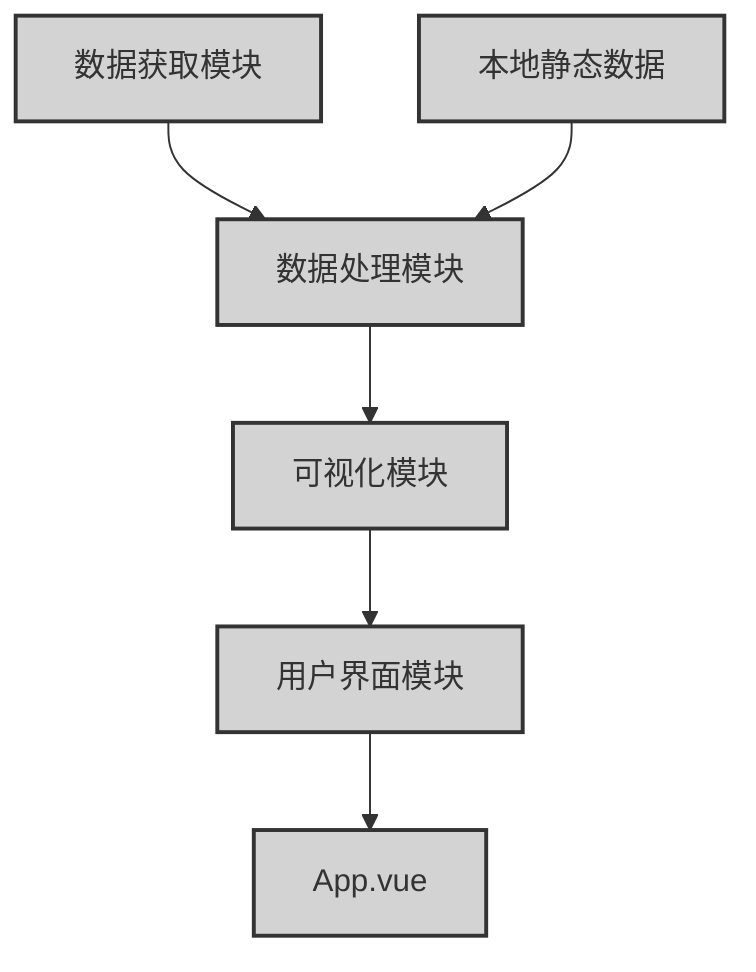
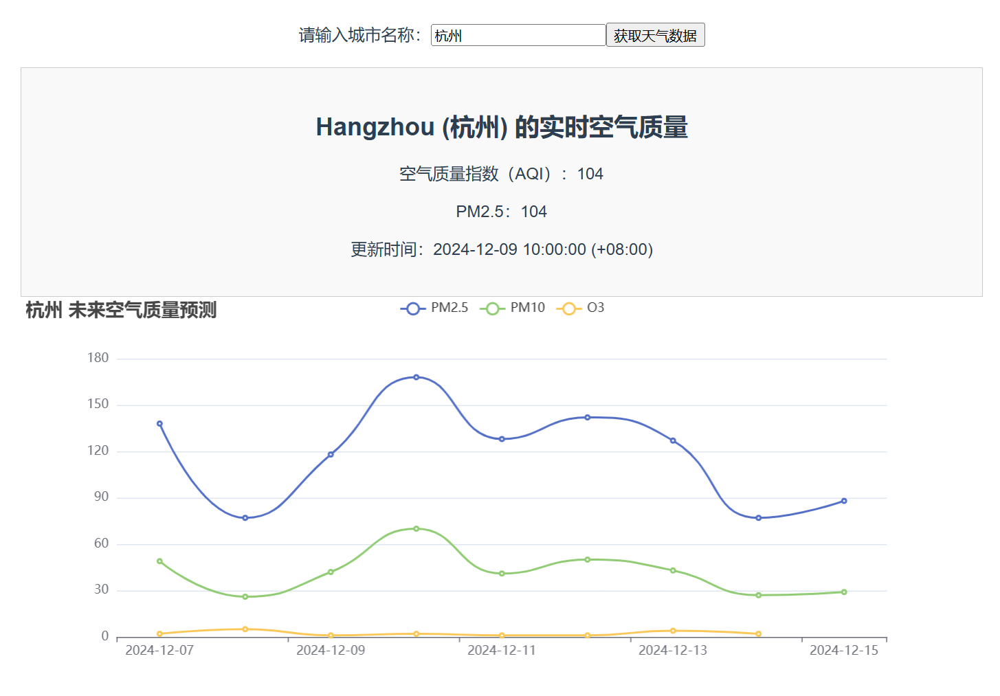
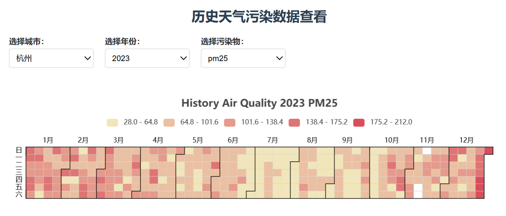
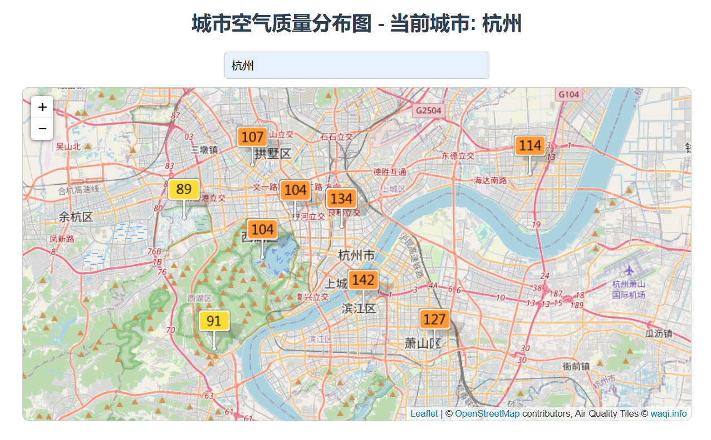
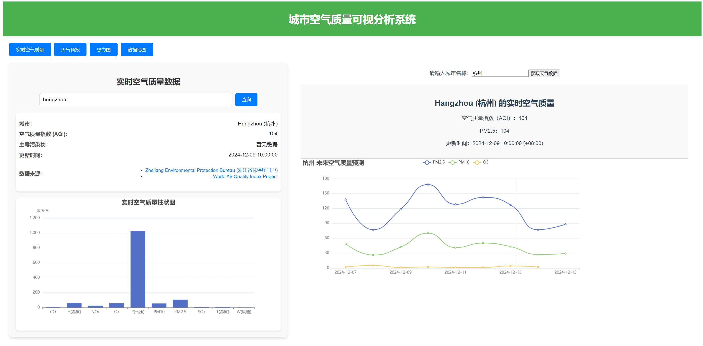
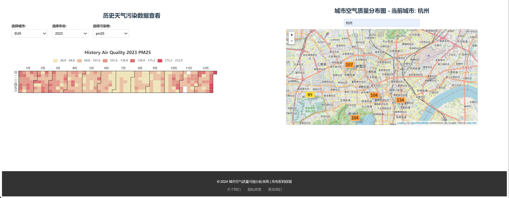

<h1 style="text-align: center; font-size: 36px; font-family: 'Arial';">Mid-Term Report</h1>

<h2 style="text-align: center; font-size: 28px; font-family: 'Arial', monospace;">城市空气质量可视分析系统</h2>

<p style="text-align: center; font-size: 18px; font-family: 'Arial', sans-serif;">Members: 李宇轩  胡竹霆  吴歆玥</p>
<p style="text-align: center; font-size: 18px; font-family: 'Arial', sans-serif;">Date: 2024-12-02</p>


## 1 项目背景
随着工业化和城市化进程的加快，空气污染已成为全球性的环境问题，对人类健康和社会经济发展产生了重大影响。在中国，快速的城市化和经济增长同样也带来了空气污染问题，如雾霾天气出现，这不仅影响了居民的生活质量，还增加了呼吸系统疾病和其他健康风险的发生率。因此，有效监控和管理城市空气质量变得尤为重要。《中华人民共和国大气污染防治法》等法律法规明确了政府、企业和公众在防治大气污染方面的责任。
近年来，随着大数据技术的发展以及传感器网络的普及，获取高精度、实时更新的空气质量数据成为可能。通过构建可视化平台，可以将复杂的数据转换成易于理解和解读的信息图表，帮助不同层次的用户更好地把握空气质量变化趋势，促进社会各界共同参与环境保护行动。我们希望创建一个更全面、更具互动性的可视化工具，能够支持多维度数据分析，为用户提供更加个性化和有价值的参考。


## 2 设计方案
### 2.1 系统架构
本项目的系统架构基于Vue.js框架，使用了标准的前端项目结构和组件化开发方式。整体架构分为多个模块，包括核心的业务逻辑、组件化视图、数据处理、静态资源管理等。具体结构如下：
```
AIR/
├── node_modules/           
├── src/   
│   ├── airQualityService.js   
│   ├── assets/              
│   ├── components/            
│   ├── utils/                 
│   ├── views/                  
│   ├── App.vue                  
│   └── main.js                  
├── .gitignore                   
├── babel.config.js              
├── package-lock.json            
├── package.json                 
├── README.md                   
└── favicon.ico                 
```


### 2.2 项目模块设计

项目的具体模块如下：



> **数据获取**
> 功能：从外部数据源获取空气质量数据。数据可以来源于两种方式：
>
> - API数据：从后端服务或第三方API（如空气质量API）实时获取城市空气质量信息，包括PM2.5、PM10、CO、NO2、SO2等污染物的浓度以及空气质量指数（AQI）。
> - CSV文件数据：从本地存储的CSV文件中读取历史或静态的空气质量数据。CSV文件通常包含空气质量的历史记录，方便用户进行趋势分析和对比。
> 作用：确保系统能够同时处理实时数据和历史数据，以便为用户提供全面的空气质量信息。

> **数据处理**
> 功能：对从API和CSV获取的原始数据进行清洗、格式化和处理，确保数据符合前端展示的需求。
> 作用：确保传递给前端的数据是准确且格式一致的，从而保证可视化展示和分析的准确性。

> **可视化模块**
> 功能：根据处理后的数据，生成可视化图表，包括折线图、柱状图、热力图等，以帮助用户理解空气质量趋势和变化情况。
> 作用：为用户提供更直观的图表展示，帮助用户快速了解空气质量变化趋势和变化情况。

> **用户界面模块**
> 功能：根据用户需求，设计用户界面，包括页眉页脚、主界面等。
> 作用：为用户提供一个易于使用的交互界面，帮助用户快速了解系统的功能和操作。


### 2.3 可视化系统模块设计
#### 实时空气质量显示
功能描述：可以查询城市的实时空气质量数据，以柱状图的形式呈现主要空气污染物（如PM2.5、PM10、CO、NO2等）的浓度及空气质量指数（AQI）还有温度、气压等参数；以仪表盘的形式呈现空气质量指数（AQI）等，不仅可以显示当前的AQI值，还能用不同的颜色范围指示空气污染的程度。
数据来源：通过接口实时获取城市实时的空气质量数据，包括PM2.5、PM10、CO、NO2、SO2等污染物的浓度、空气质量指数（AQI）还有温度、气压等。
交互设计：在柱状图中，用户可以选择不同城市查看实时数据，并中悬停查看具体数值；在仪表盘中，用户可以查看当前城市的空气质量指数（AQI）。

#### 未来空气质量预测
功能描述：可以查询未来的空气质量预测数据，以折线图的形式呈现主要空气污染物（如PM2.5、PM10、CO、NO2等）的浓度。
数据来源：通过接口获取未来空气质量预测数据，包括PM2.5、PM10、CO、NO2、SO2等污染物的浓度。
交互设计：支持不同时间范围的选择，（如未来三天和未来七天）；可以悬停查看具体数值；可以选择显示的污染物。


#### 历史空气质量热力图
功能描述：可以查看城市的历史空气质量数据，以热力图的形式呈现主要空气污染物（如PM2.5、PM10、CO、NO2等）的浓度。
数据来源：从本地数据集中读取历史空气质量数据。
交互设计：支持日期选择，可以查看指定日期的历史数据；支持城市选择，可以查看指定城市的历史数据；支持污染物选择，可以查看指定污染物的历史数据；可以悬停查看具体数值。


#### 空气质量地图
功能描述：通过地图展示城市或多个城市的实时空气质量数据，并使用不同颜色和标注来表示空气质量的好坏。
数据来源：API获取实时空气质量数据。使用地图API（如Google Maps、Leaflet或高德地图）来展示地图，支持缩放和区域拖动。
交互设计：用户可以通过点击不同的城市或区域，查看具体的空气质量数据，并可以选择查看不同的污染物浓度。


**...**


## 2.3 目前实现进展
- 完成了基本项目架构的搭建，包括项目依赖包、目录结构、配置文件等。
- 完成了用户界面模块的实现，包括页眉页脚、主界面等。
```
Homepage.vue
AppFooter.vue
Appheader.vue
```

- 完成了数据获取模块的实现，通过接口获取实时的空气质量数据。
```
airQualityService.js
```

- 实现了数据处理模块，实现了对获取的数据进行清洗、格式化和处理，确保数据符合前端展示的需求。
```
processData.js
```

- 实现了部分可视化模块，包括显示未来空气质量的折线图、实时空气质量的柱状图以及历史空气质量的热力图、地图等。




## 2.4 待完成工作
- 完善已经实现的图表：需对已经实现的折线图、柱状图、热力图等进行完善，完善数据展示和交互功能，美化图形样式，提升用户体验。
- 地图模块集成：地图模块尚未完成，需集成地图显示与动态空气质量数据展示（如热力图、标记等）。预期通过地图动态展示空气质量数据，支持点击、悬停、放大缩小等交互操作，展示详细信息。
- 添加更多功能：如空气质量指数的仪表盘、空气质量趋势的图表等，以增加系统的功能和用户体验。
- 优化交互功能：目前的交互功能不够完善，需要优化交互体验。
- 优化可视化界面：现有的界面布局可能较为简单，缺乏层次感和交互设计。需要通过改进布局，使数据展示更加清晰直观，便于用户快速获取信息。可以通过模块化设计，或者通过大小、颜色、间距等设计方式，为不同模块和数据设置视觉优先级，以及响应式布局等方式，使界面更加友好。
- 优化颜色与主题设计：颜色和主题设计是影响用户体验的重要因素，合适的配色方案不仅能让用户快速理解数据，还能提升页面的美观度。预期为系统设计一个统一的配色主题，确保所有页面元素（按钮、图表、背景等）具有一致的视觉风格；对于柱状图、折线图等数据图表，使用渐变色来表示数据范围等。
- 创意拓展：
    - 沉浸式体验与动态数据展示：根据实时空气质量的好坏变化，整个系统的背景颜色、天气图标、空气场景（如云层、阳光等）会发生变化。例如，当某个城市的AQI值高时，页面背景变为灰色或阴霾，低AQI时则变为清爽的蓝天；不同的空气质量等级使用不同的图标和配色，如黄色代表警惕、红色代表危险、绿色代表清新，配合简单的卡通图标、表情等视觉元素，提升系统的亲和力。
    - 个性化定制和用户参与感：用户可以根据自己所在的城市、关心的指标（如PM2.5、AQI、温湿度等）以及数据展示方式来自定义仪表板或可视化界面，使得每个用户都有属于自己的“专属空气质量分析界面”。
    -  健康建议与行动呼吁：系统不仅提供空气质量数据，还能结合数据给出具体的健康建议，鼓励用户采取行动来减少空气污染，并提高个人的环保意识。
    - 交叉分析功能：选择多个维度的数据进行对比，查看不同污染物之间的关系。例如，PM2.5浓度与NO2浓度的变化趋势对比，或者气温变化与AQI变化的关系等等。
